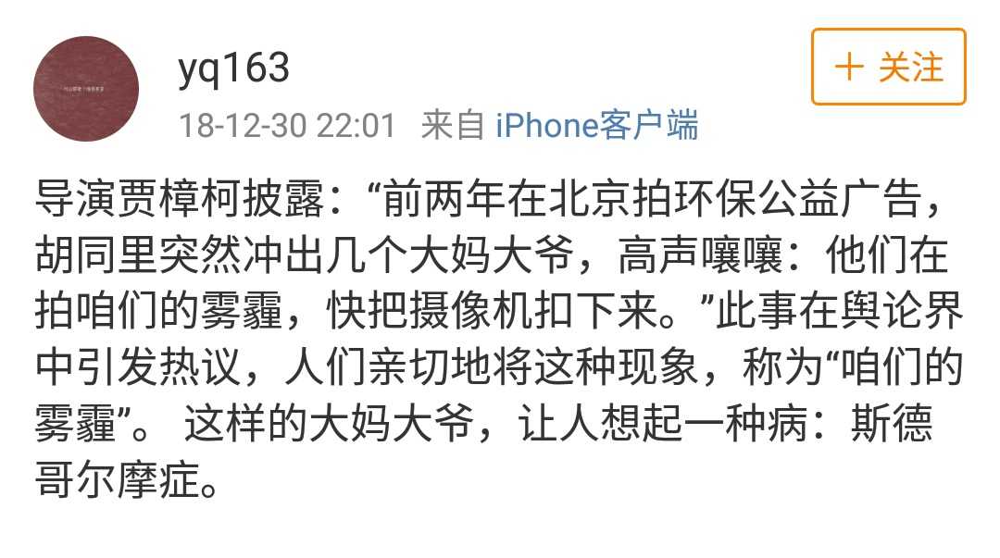

**注：**

1. 记录个人一日（也许是近几日）所见/所为，有些内容只是当时觉得不错，但并没有全部认真看过，不对内容质量负责。
2. 红色链接在微信中无法点击，如果需要打开，请到文尾复制相应链接，在复制到浏览器中打开。
3. 阅读原文可以查看更完整的内容。

###  过往

- 上午去某中学领体检表、购物，2小时
- 体操21分钟，期间 kindle 购《奇特的一生》2元
- 整理《你不该犯的逻辑谬误》，2小时，完成，稍后可以发布

### 时政

- 2019/03/19 [华为在德国的命运，捏在谁手中？](https://mp.weixin.qq.com/s?__biz=MzA4NjUwNjI1OA==&mid=2650681223&idx=1&sn=640328f2eabd13168b597cd097ad2d6a&chksm=87cd21fab0baa8ec04a8ededc698d346b44a7e205ed26a284aa843dd9a60c4f77e8656160c49&mpshare=1&scene=1&srcid=&pass_ticket=RU2sVSP7iUxCtRO5RomHxv%2FtYQE9wcXKoMZAWS%2FkbmtVJrJNkEyxkuH0GuqrKgRs#rd)  

### 社会

- 2019/03/20 [成都七中食堂事件：刷屏的日本小学生午餐，到底是怎么来的？](https://mp.weixin.qq.com/s?__biz=MzA5NTU0NzY2Mg==&mid=2651272225&idx=1&sn=1da68cd5aa7aaa56980b455a2107d751&chksm=8b4e2c40bc39a556145fae1267a50b3ed8c8a956e90cb96418ee79304c4de43e43b73213b42c&mpshare=1&scene=1&srcid=0320SKGrIlyUSfW8uEkc4Q9P&pass_ticket=RU2sVSP7iUxCtRO5RomHxv%2FtYQE9wcXKoMZAWS%2FkbmtVJrJNkEyxkuH0GuqrKgRs#rd)  //介绍日本当年如何成功解决有毒食品问题
- 2015/11/18 [当回教徒人口多于X%的时候](https://mp.weixin.qq.com/s?__biz=MjM5NjYyMTAzOA==&mid=400700829&idx=2&sn=8a622b367d12e56c8e6fec8580725ec3&chksm=34f0ea1c0387630a1fb73139d80a5a1a6132899405c5bfbc2c8be5a1a28d70dfaa94a3478879&mpshare=1&scene=1&srcid=1119FP28nNp7QrPDpXCVCRiB&pass_ticket=RU2sVSP7iUxCtRO5RomHxv%2FtYQE9wcXKoMZAWS%2FkbmtVJrJNkEyxkuH0GuqrKgRs#rd)  //一个说法，描述穆斯林数量与质量的关系

### 婚姻

- 2019/03/19 [北京离婚率48.3%揭示：婚姻制度即将消亡！](https://mp.weixin.qq.com/s?__biz=MzIyNzgwMTIzNw==&mid=2247491107&idx=4&sn=26ba8f5f21a142751340e70b6d27fac6&chksm=e85affd9df2d76cf800f2abde285578e9eca7b6971979c9bd9f49648dd211f8b9b4ec48312a8&mpshare=1&scene=1&srcid=0319AuldqpT0zsKiZRcN3Qg7&pass_ticket=RU2sVSP7iUxCtRO5RomHxv%2FtYQE9wcXKoMZAWS%2FkbmtVJrJNkEyxkuH0GuqrKgRs#rd) //论婚姻制度灭亡的必然性
- 2019/03.04 [你对婚姻制度怎么看？](https://mp.weixin.qq.com/s?__biz=MzA5NzE1ODI2Mg==&mid=2649331380&idx=1&sn=106f0a3ed6011a2ae8ec052c28f7bab0&chksm=88b823adbfcfaabbc3bda3c7cfd2f78f4840154764309ad1d7e7209bdd088c8300ad1bd599c2&mpshare=1&scene=1&srcid=&pass_ticket=RU2sVSP7iUxCtRO5RomHxv%2FtYQE9wcXKoMZAWS%2FkbmtVJrJNkEyxkuH0GuqrKgRs#rd)   //问题及烧脑的答复

### 柳比歇夫

- 2019/03/02 [学会柳比歇夫时间统计法，你也可以开创奇特的一生](https://mp.weixin.qq.com/s?__biz=MzU3NDc3OTU1MA==&mid=2247483959&idx=1&sn=dfc02ee61f32e9d80382e41731dbf5b1&chksm=fd2c7bc6ca5bf2d06fb013d7abaa7c15bdda3c8d4978dbe8ca2d5edcaf65b5edb47a7ed55f81&mpshare=1&scene=1&srcid=0320RYyS2llQXt6ZLZIX3rP5&pass_ticket=RU2sVSP7iUxCtRO5RomHxv%2FtYQE9wcXKoMZAWS%2FkbmtVJrJNkEyxkuH0GuqrKgRs#rd)  //《奇特的一生》是介绍柳比歇夫的书。
- 2015/08/10 [时间统计法 | 善于工作的人，时间总是够用的](https://mp.weixin.qq.com/s?__biz=MjM5OTA3MjUwMA==&mid=209892271&idx=1&sn=fa9a92150c7f9aee13c4ff3ca6f63f39&mpshare=1&scene=1&srcid=03206JHW1SCITV90T3DIz3SS&pass_ticket=RU2sVSP7iUxCtRO5RomHxv%2FtYQE9wcXKoMZAWS%2FkbmtVJrJNkEyxkuH0GuqrKgRs#rd) //介绍时间统计法。

### 图片

