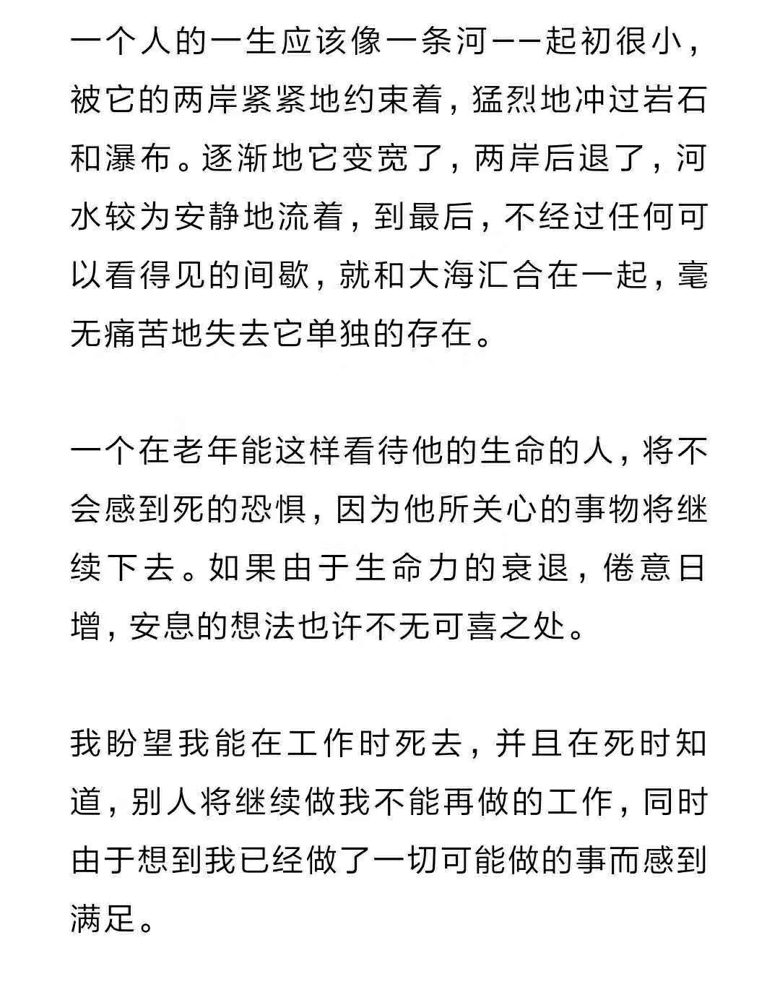

# 网海拾渣

读到
--

#### 互联网
- 2019/02/02，keso  [我为什么讨厌头条](<https://mp.weixin.qq.com/s?__biz=MzI1ODIyMjAwMA==&mid=2247485506&idx=1&sn=0e2a38dc960d879977836d52a48aaa3f>) 

#### 认知
- 2019/03/20，[想法的几何学：大脑如何构建内在的意义宇宙？](<https://mp.weixin.qq.com/s?__biz=MzIzMjQyNzQ5MA==&mid=2247496609&idx=1&sn=684cec01d47b81c9b8a2daf9eb5ca47f>)
- 2018/09/12，[头脑封闭和头脑开放的迹象](https://mp.weixin.qq.com/s?__biz=MzU4NjM4ODU4Mg==&mid=2247483752&idx=1&sn=a921247a9cdb350ab3f982cb64081d9c&chksm=fdfd4461ca8acd7789161f6ca879b9ce47aa5a84ca3a27f74a47812a67639526200ea56911ac&mpshare=1&scene=1&srcid=0325BF86dkyYBGg78eSYIQEr&pass_ticket=p5%2BRXnEDWdW%2FNU6gRtOaVmoTzseupOtPMMxXv6pgbT2yHBd0Cr9ENTkh6OI5YATW#rd) 

#### 卡片
- 2016/11/21， [像纳博科夫一样写作：卡片创作法](<https://mp.weixin.qq.com/s?__biz=MzA4MTQ0NDQxNg==&mid=2650639168&idx=1&sn=a612b22c336488479b91505978feab40>) 
- 2015/04/23，阳志平，[纳博科夫的卡片](<https://mp.weixin.qq.com/s?__biz=MzA3MzYzNjMyMA==&mid=204670097&idx=1&sn=02c2613271bb158861848f8d3773d193>)

#### 数据挖掘
- 2019/03/22，[还在一个个写规则？来了解下爬虫的智能化解析吧！](https://mp.weixin.qq.com/s?__biz=MzI2NjY5NzI0NA==&mid=2247485792&idx=1&sn=b3264e782889e4d368a7f38afd137e86&chksm=ea8b6613ddfcef0536d1b388b7c412e8f8f18a49c177947d330f6b7e394243909a43b6bd2097&mpshare=1&scene=1&srcid=0325GJOgtkoElluInMQLMQWT&pass_ticket=p5%2BRXnEDWdW%2FNU6gRtOaVmoTzseupOtPMMxXv6pgbT2yHBd0Cr9ENTkh6OI5YATW#rd)

#### 能力
- 2019/03/23，[11岁就敢叫板支付宝，会写代码的孩子到底多可怕？](https://mp.weixin.qq.com/s?__biz=MzA4NjUwNjI1OA==&mid=2650681282&idx=1&sn=d49be53a75fe724cf29a64d2c31e0df9&chksm=87cd21bfb0baa8a92202e73ca4fa93cf32e6498a209f4f434b5870f7373775f53e9caf5e86a1&mpshare=1&scene=1&srcid=0325ETWOWSZq4pzjcldjen6L&pass_ticket=p5%2BRXnEDWdW%2FNU6gRtOaVmoTzseupOtPMMxXv6pgbT2yHBd0Cr9ENTkh6OI5YATW#rd)
- 2019/03/23，阳志平 [一点自由](https://mp.weixin.qq.com/s?__biz=MzA3MzM0MjUyMQ==&mid=2652150608&idx=1&sn=65d8c17f3ea7622ff55c5b41b8f0b9d8&chksm=84f0b006b3873910ec9478543e4f1a25f7f6111248ba00e98083e8f435f90ac7b569f75b9f40&mpshare=1&scene=1&srcid=0325ZJcrEmQ1R35EfHkjOzWb&pass_ticket=p5%2BRXnEDWdW%2FNU6gRtOaVmoTzseupOtPMMxXv6pgbT2yHBd0Cr9ENTkh6OI5YATW#rd)

#### 社会
- 2019/03/24，[张千帆讲座：新契约](https://mp.weixin.qq.com/s?__biz=MzIxOTYwMTczMg==&mid=2247487037&idx=1&sn=1ee6009afd5b572ff0b9a1a8374b448d&chksm=97d98016a0ae090055ec6c612bdb0d7d4a54947ed1f51c472645f9a5e85522a158bfdb772510&mpshare=1&scene=1&srcid=&pass_ticket=p5%2BRXnEDWdW%2FNU6gRtOaVmoTzseupOtPMMxXv6pgbT2yHBd0Cr9ENTkh6OI5YATW#rd)
- 2019/01/29， [严重交涉无效怎么办？](<https://mp.weixin.qq.com/s?__biz=MzU1OTM1MjIxNA==&mid=2247489219&idx=1&sn=42163f0d42b546fb5b0f78247dec223c>)  

#### 高考
- 2019/03/22，[揭秘：高考试卷的从出产到销毁的4大环节](https://mp.weixin.qq.com/s?__biz=MzIyNDc0MzA3OA==&mid=2247486493&idx=5&sn=49ba315704d765dba536c3a64d280749&chksm=e80b17d4df7c9ec2b21691d11b51ae0c049f22789447e274591b586a5e9e0d11f8b0f6ddf6b0&mpshare=1&scene=1&srcid=0325YLxnbmJobAtRsolcpQAu&pass_ticket=p5%2BRXnEDWdW%2FNU6gRtOaVmoTzseupOtPMMxXv6pgbT2yHBd0Cr9ENTkh6OI5YATW#rd)

#### 通讯
- 2019/03/22，[山西联通多项5G首发项目落地三晋](https://mp.weixin.qq.com/s?__biz=MjM5NTc4MjUzNQ==&mid=2658211621&idx=1&sn=50ed1eea4fe97dce158409c091e4245d&chksm=bd76fdcd8a0174db84f9db035d532b5c36830ed60d797b4f5a5a43a46c6e1baef89a7588e2a8&mpshare=1&scene=1&srcid=&pass_ticket=p5%2BRXnEDWdW%2FNU6gRtOaVmoTzseupOtPMMxXv6pgbT2yHBd0Cr9ENTkh6OI5YATW#rd)

#### 宗教
- 2017/04/30，[伊斯兰主义](https://mp.weixin.qq.com/s?__biz=MzI2NDM3NDgxNQ==&mid=2247484781&idx=1&sn=c55453670cdfeab7d6d9e7187e49d2ed&chksm=eaacda1ddddb530b440eb3a6ae9cdf67e6d612bae34c94cdad0db2c0fe80fded05899f837156&mpshare=1&scene=1&srcid=0322GKxrMUHyYCmuokxkG1ri&pass_ticket=p5%2BRXnEDWdW%2FNU6gRtOaVmoTzseupOtPMMxXv6pgbT2yHBd0Cr9ENTkh6OI5YATW#rd)    

只言片语
----

> 时间记录法目前对于我的一个难点是：**记住开始时间**

>  五行缺四个字：「 抓 紧 时 间 」。 

> 看见好吃的不要到处说，先悄悄的自己吃，等吃肥了，再拍着圆肚子给他人看。   #论反分享主义

> 有时候，「 感性行动想法 」比「 理性行动想法 」更适合人吧，因为人本身是肉体的，会受精力、精神状态的影响，而不是一个纯理性控制的机械物。

>  好像很多事情，我都知道它好的一面与坏的一面。 
>
>  然后，问题来了：  这样的话，究竟应该如何对一件事发布看法呢？ 

>  刚才有路人称它小狗，内心的台词是：它都这么大了 …… 

>  又想了一下，《绿皮书》就是弘扬真善美（真，自己做好自己的事；善，乐助他人；美，获得尊严的努力）。
>  也就是：自己真善美，且尊重与乐见他人追求真善美。 

>  想启动个人基础项目：「 重生工程 」 。 
>
>  叁方面内容：健康、亲情、信息。 

>  有没有可能，有一种状态为：「 乐不思俗 」？ 

>  用上帝视角去看，人类的所有行为都是「 俗 」吧。 

>  人设本来就是用来毁的。 

>  怎么才能设计一种容易安装与卸载的被罩？   #论想开家庭青年旅行社的重要问题 

>  美术校考，课余时间，男生有空就玩游戏，女生有空就看剧；不用手机的时候会讨论校考相关。 

>  要么个人有自制力，要么系统强大。

> 需要一个搜索个人所有信息的搜索引擎。 

#### 胡思乱想

>  

> 「 鸡汤 」有没有反义词，是什么？ 

>  你认为该如何与惯骗打交道？  
>
> 1. 再打交道之前，让骗子先写不欺骗的保证；
> 2. 再打交道时，只做能立即兑现的交易；
> 3. 不再与骗子打交道。

>  因果其实也不是确定的。 
>
>  一个因产生什么果，大比例也是偶然性产生作用。 
>
>  但是，如果出现某种果，则果必然由某种因导致。 
>
>  这种关系多少也可以重新定位什么是偶然性与必然性。 
>
>  有些人，可能从来没有做错什么。 
>
>  但他仍然没有做对什么。 

>  为理想而来的想法。  

#### 社会

>  秦晖：历史的不确定性就是我们每一个人努力的价值之所在。 

> 某营私团伙不只知道现在社会上有多少蠢货，还知道如何合理利用这些蠢货。

>  互联网 ＋ 集权专制 ＝ 谣言² ＝ 没有真相 

>  「 我是修长城的，你是盖猪圈的，我们确实不是竞争对手，可是架不住你总想挖了长城砖去盖猪圈。 」 

>  打击抽象与空洞的概念性/理论性说法的方法就是用具体事例去提问。 

> 在现有社会情况下，如果充分整合现有数据，并做好过滤规则，差不多可以百分之百发现贪污腐败迹象吧，，，，。 
>
> 所有官员的亲戚家属树，与购房、购车、购物、出国、升迁、企业、上学、就医等等数据相匹配。 
>
> 有什么是能得不出的？ 
>
> 除非贪污腐败份子有黑客的安全防范技能，但即使这样，除非没有猪队友，否则也很不容易保护住蛛丝马迹。 

>  豁然意识到：信息不（完全）公开，是为了垄断信息，是为了信息集权。 
>
>  集权也许可以为公，但集权有了营私的足够条件，往往导向营私。 

>  教育应独立，会被一些人认为有问题，显然毒奶长进肉里了。 

>  “意识形态” 是一种有色眼镜，它切断了人们对真正问题的思考与看法。 

> 墙存在的意义

